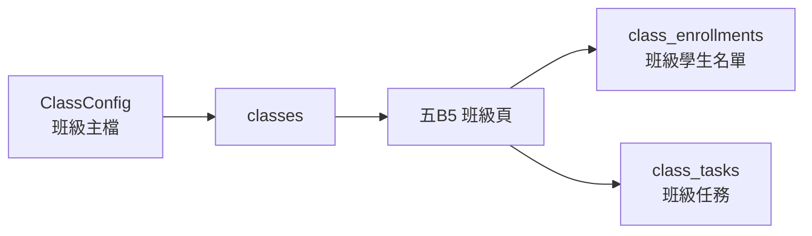

# ClassConfig 分頁白話功能整理

日期：2026-06-14

來源：使用者提供的 `ClassConfig` header 與範例資料。

## 一句話版

`ClassConfig` 是班級主檔。

它不是老師每天操作的班級頁，而是記錄「這個班是什麼班、對應哪個 Google Sheet 分頁、未來作帳怎麼算」的設定表。

## 目前欄位

| 欄位 | 白話意思 | 範例 |
|---|---|---|
| `classId` | 穩定班級 ID | `CLS-001` |
| `sheetName` | Google Sheet 分頁名稱 | `發3` |
| `classCode` | 短代碼 / 對外或內部分類碼 | `E` |
| `className` | 班級顯示名稱 | `發3`、`基礎發音班` |
| `department` | 部門 | 可空白 |
| `level` | 程度/級別 | `初級` |
| `classType` | 班型 | `double`、`intensive` |
| `weekday1` | 第一個上課星期 | `2` |
| `weekday2` | 第二個上課星期 | `4`、`5`、或 `0` |
| `systemSessions` | 系統預設堂數 | `24` |
| `status` | 班級狀態 | `active` |

## classId / sheetName / classCode / className 差別

| 名稱 | 用途 | 可不可以改 |
|---|---|---|
| `classId` | 系統用來認班的穩定 ID，例如 `CLS-001`。 | 盡量不要改。 |
| `sheetName` | 舊 Google Sheet 分頁名稱，例如 `五B5`、`發3`。 | 舊資料匯入時很重要。 |
| `classCode` | 短代碼，例如 `E`、`F`、`G`。可能用於分班、作帳、報表分類。 | 可以改，但要知道影響報表。 |
| `className` | 給人看的班級名稱，例如 `基礎發音班`。 | 可以改，主要影響顯示。 |

所以 `classCode` 不一定是 `五B5`。

更準確的說法是：

- `sheetName` = 舊 Google Sheet 分頁叫什麼
- `classCode` = 班級短代碼
- `className` = 人看得懂的班級名稱
- `classId` = 系統穩定識別碼

## 對新版 DB 的影響

`classes` 這張表應該不只放班名，還要先保留作帳會用到的欄位。

建議第一版 `classes` 欄位：

| 欄位 | 記什麼 |
|---|---|
| `id` | 系統內部 ID |
| `legacy_class_id` | 舊 `classId`，例如 `CLS-001` |
| `sheet_name` | 舊分頁名稱，例如 `五B5` |
| `class_code` | 短代碼，例如 `E` |
| `class_name` | 顯示名稱，例如 `基礎發音班` |
| `department` | 部門 |
| `level` | 程度/級別 |
| `class_type` | 班型，例如 `double` / `intensive` |
| `weekday1` | 第一個上課星期 |
| `weekday2` | 第二個上課星期 |
| `system_sessions` | 預設堂數 |
| `status` | active / inactive |
| `note` | 備註 |

## 和五B5的關係

`ClassConfig` 管「這個班的設定」。

`五B5` 管「老師在這個班每天要操作什麼」。

