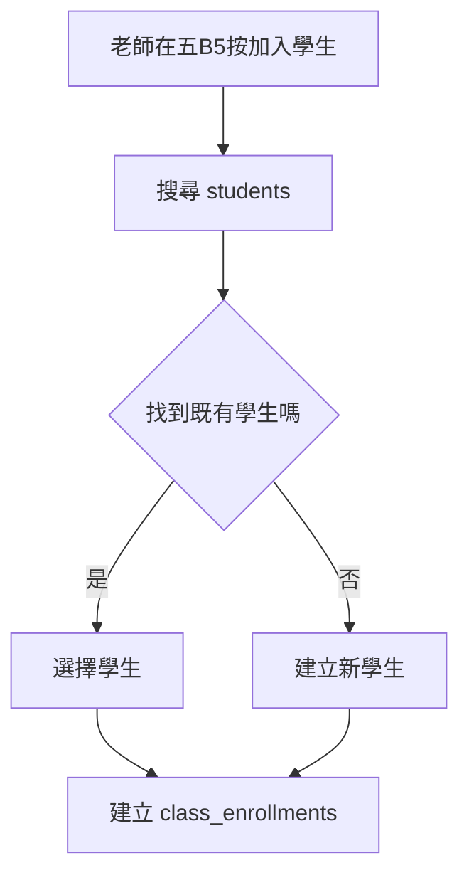
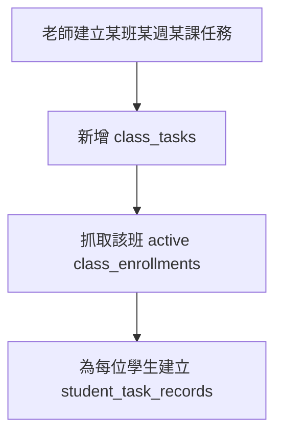

# Claude Code Prompt: JianYiOS Clean Supabase DB Rebuild

請協助 JianYiOS 重新設計乾淨的 Supabase DB schema。

目前結論：不要繼續整理舊 Google Sheet / AppSheet 搬過來的表格結構。舊表是歷史參考，不要把它們修成正式架構。新的 app 應該使用少數幾張乾淨的新表。

## 重要原則

1. 不要照抄 Google Sheet 的格子結構。
2. 不要把 `sheetName` 當核心欄位，新 app 不靠分頁定位班級。
3. 不要把舊的 `studentId` / `classId` / `taskId` 當資料庫關聯 key。
4. 每張新表都用自己的 `id` 當真正唯一 ID。
5. 表跟表之間用 UUID foreign key 連接。
6. 舊表可以全部移除，但請先做 migration 草稿，不要直接動 live DB。
7. 第一版不要過度拆表，先支援五B5這種英文班級工作流。

## 需要保留的業務概念

### StudentRoster

`StudentRoster` 是全校學生主名冊，不是班級名單。

目前欄位概念：

- chineseName
- englishName
- status
- school
- grade
- note
- updatedAt
- parentName
- parentPhone

舊的 `studentId` 是 Google Sheet / AppSheet 時代為了沒有 database key 才建立的人工代號。新版核心 schema 不需要靠它連資料。

### 五B5

`五B5` 是英文班級頁，同時是老師操作面板。

它包含：

- 班級資料
- 班級學生名單
- 老師新增學生到班級
- 某週某課的任務
- 每位學生對每個任務的狀態、分數、歷史、備註
- 評論列：給家長看的評論文字與發布狀態

## 新版核心資料表

請先用以下 5 張表設計：

1. `students`
2. `classes`
3. `class_enrollments`
4. `class_tasks`
5. `student_task_records`

## 建議欄位

### 1. `students`

用途：全校學生主檔。

欄位：

- `id` uuid primary key
- `chinese_name` text
- `english_name` text
- `status` text, active / inactive
- `school` text nullable
- `grade` text nullable
- `note` text nullable
- `parent_name` text nullable
- `parent_phone` text nullable
- `created_at` timestamptz
- `updated_at` timestamptz

不要用舊的 `studentId` 當 key。

### 2. `classes`

用途：班級主檔，也會被帳務功能使用。

欄位：

- `id` uuid primary key
- `class_name` text
- `department` text nullable
- `level` text nullable
- `class_type` text nullable, examples: double / intensive / single
- `weekday1` integer nullable
- `weekday2` integer nullable
- `system_sessions` integer nullable
- `status` text, active / inactive
- `created_at` timestamptz
- `updated_at` timestamptz

不要放 `sheet_name`。
不要把舊 `classId` 當 key。

`class_code` 先不要放，除非 app 真的需要一個人類可看的短代號。第一版可以只用 `class_name`。

### 3. `class_enrollments`

用途：記錄哪個學生加入哪個班。

這張需要保留，不能把班級直接塞進 `students`，因為同一個學生可能在多個班，也可能換班、退班、回班。

欄位：

- `id` uuid primary key
- `class_id` uuid references `classes(id)`
- `student_id` uuid references `students(id)`
- `status` text, active / dropped
- `slot_order` integer nullable
- `joined_at` date nullable
- `left_at` date nullable
- `created_at` timestamptz
- `updated_at` timestamptz

加入學生到五B5時：

1. 先搜尋 `students`
2. 找到既有學生就建立 `class_enrollments`
3. 找不到才建立 `students`
4. 再建立 `class_enrollments`

### 4. `class_tasks`

用途：某班、某週、某課的某個任務。

先不要獨立建立 `lessons` 表。五B5目前的 W1 / L1 / L2 是老師自訂標籤，直接放在任務上即可。

欄位：

- `id` uuid primary key
- `class_id` uuid references `classes(id)`
- `week_label` text nullable, examples: W1 / W2
- `lesson_label` text nullable, examples: L1 / L2
- `task_type` text, attendance / homework / practice / quiz / comment
- `task_name` text nullable
- `threshold` numeric nullable
- `display_order` integer nullable
- `status` text, active / archived
- `created_at` timestamptz
- `updated_at` timestamptz

不要保留舊 `TaskID` / `taskId`。
任務真正的 ID 就是 `class_tasks.id`。

`display_order` 用來取代 Google Sheet 的列順序，讓 app 知道任務在畫面上怎麼排序。

### 5. `student_task_records`

用途：每位學生對每個任務的狀態、分數、歷史、備註、評論。

這張表相當於新版 app 裡取代 Apps Script Buffer 的正式資料表。

欄位：

- `id` uuid primary key
- `class_task_id` uuid references `class_tasks(id)`
- `student_id` uuid references `students(id)`
- `status` text, examples: pending / completed / correcting / missing / exempt / redo
- `lamp` text nullable, examples: red / green / yellow / blue / black / white
- `latest_result` text nullable
- `result_history` text nullable
- `teacher_note` text nullable
- `comment_text` text nullable
- `comment_status` text nullable, draft / pending_publish / published / needs_republish
- `created_at` timestamptz
- `updated_at` timestamptz

第一版不要另外拆 `student_comments`。
五B5 的評論列可以視為一種 `class_tasks.task_type = comment`，評論內容與發布狀態先存在 `student_task_records`。

## 舊表處理方向

目前舊表與 legacy bridge 表都不要再當正式 app schema。

請準備 migration 草稿，目標是移除舊表，改用上面 5 張新表。

可能舊表包含：

- `class_students`
- `tasks`
- `task_records`
- `class_enrollments`
- `class_tasks`
- `task_buffer_entries`
- `appsh_kanban_rows`
- `appsh_xiao_daily_rows`
- `legacy_sheet_schemas`
- `legacy_appscript_files`
- `kanban_ranges`
- 其他只為 Google Sheet / AppSheet bridge 存在的表

注意：

- 不要直接修改 live Supabase。
- 先產生 migration 草稿。
- 如果需要保留舊資料，請另外建立匯出/備份策略，不要讓舊表污染新 schema。

## 需要產出的東西

請產出：

1. 新 schema migration SQL。
2. 清楚的資料表說明文件。
3. 一張 mermaid ER 圖。
4. 五B5「加入學生」流程的實作邏輯。
5. 五B5「建立任務」與「建立每位學生任務紀錄」流程。

## 五B5 主要流程

### 加入學生

### 建立任務

## 最終目標

讓 JianYiOS 從 Google Sheet / AppSheet 時代的人工 key 與分頁架構，轉成乾淨的 Supabase app schema：

- 學生是學生
- 班級是班級
- 班級名單是學生和班級的關係
- 任務是班級底下的任務
- 任務紀錄是每位學生對每個任務的結果

