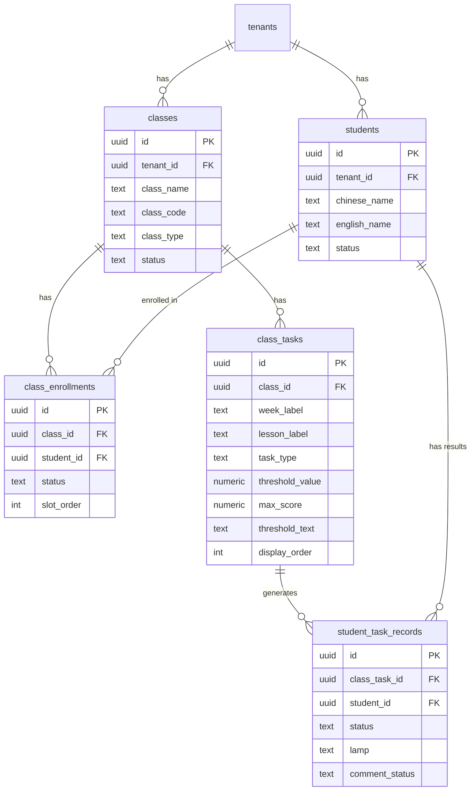
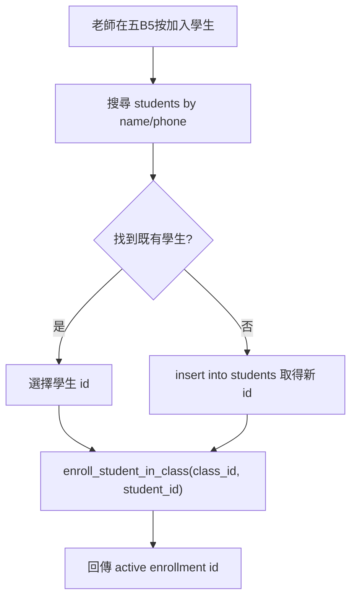
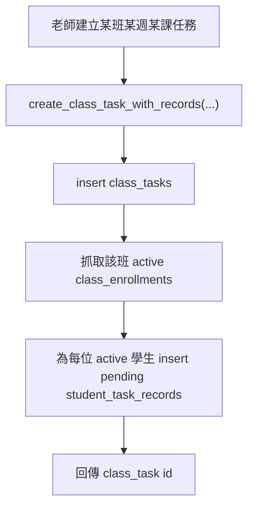

# JianYiOS Clean Core Schema

新版 app 的正式資料模型。取代 Google Sheet / AppSheet 時代的人工 key 與分頁架構。

> 來源方向：[`docs/claude-clean-db-rebuild-prompt.md`](./claude-clean-db-rebuild-prompt.md)
> Migration 草稿：[`supabase/migrations/drafts/202606140001_clean_core_rebuild.sql`](../supabase/migrations/drafts/202606140001_clean_core_rebuild.sql)

## 核心原則

- 學生是學生、班級是班級、班級名單是兩者的關係、任務是班級底下的任務、任務紀錄是每位學生對每個任務的結果。
- 每張表用自己的 `id` (uuid) 當唯一 ID，表跟表之間用 UUID foreign key 連接。
- 不靠 `sheetName` / 舊 `studentId` / `classId` / `taskId` 定位資料。
- 每張表都有 `tenant_id` + RLS（沿用現有 `profiles.tenant_id` 的多租戶模型，符合 `AGENTS.md` 規範）。
- **租戶一致性以 composite FK 在 DB 層強制**：子表的 `(parent_id, tenant_id)` 參照父表的
  `(id, tenant_id)`，所以 enrollment / task / record 的 `tenant_id` 一定等於其 class / student 的
  `tenant_id`，不可能跨租戶錯接（不靠 trigger，純宣告式約束）。

## 5 張核心表

### 1. `students` — 全校學生主名冊

不是班級名單，是全校主檔（對應舊 `StudentRoster`）。

| 欄位 | 型別 | 說明 |
|---|---|---|
| `id` | uuid PK | 真正的學生 ID |
| `tenant_id` | uuid FK→tenants | 租戶 |
| `chinese_name` | text | |
| `english_name` | text | |
| `status` | text | `active` / `inactive` |
| `school` | text | nullable |
| `grade` | text | nullable |
| `note` | text | nullable |
| `parent_name` | text | nullable |
| `parent_phone` | text | nullable |
| `created_at` / `updated_at` | timestamptz | |

### 2. `classes` — 班級主檔

也會被帳務功能使用。不放 `sheet_name`。`class_code` 是可選的人類可讀代號，不是主鍵。

| 欄位 | 型別 | 說明 |
|---|---|---|
| `id` | uuid PK | 真正的班級 ID |
| `tenant_id` | uuid FK→tenants | |
| `class_name` | text NOT NULL | 例：五B5 |
| `class_code` | text | nullable，人類可讀代號，作帳 / 搜尋用，**不是主鍵**。同租戶內非空值唯一 |
| `department` | text | nullable |
| `level` | text | nullable |
| `class_type` | text | double / intensive / single |
| `weekday1` / `weekday2` | integer | nullable |
| `system_sessions` | integer | nullable |
| `status` | text | `active` / `inactive` |
| `created_at` / `updated_at` | timestamptz | |

### 3. `class_enrollments` — 班級名單（學生 ↔ 班級關係）

不能把班級塞進 `students`，因為同一個學生可能在多班、換班、退班、回班。

| 欄位 | 型別 | 說明 |
|---|---|---|
| `id` | uuid PK | |
| `tenant_id` | uuid FK→tenants | |
| `class_id` | uuid FK→classes | |
| `student_id` | uuid FK→students | |
| `status` | text | `active` / `dropped` |
| `slot_order` | integer | nullable，畫面排序 |
| `joined_at` / `left_at` | date | nullable |
| `created_at` / `updated_at` | timestamptz | |

**唯一性**：partial unique index `(class_id, student_id) where status = 'active'`。
同一學生在同班只能有一筆 active，但保留歷史的 dropped 紀錄，可重新入班。

### 4. `class_tasks` — 某班 / 某週 / 某課的任務

W1 / L1 / L2 是老師自訂標籤，直接放在任務上，v1 不獨立建 `lessons` 表。
任務真正的 ID 就是 `class_tasks.id`。

| 欄位 | 型別 | 說明 |
|---|---|---|
| `id` | uuid PK | |
| `tenant_id` | uuid FK→tenants | |
| `class_id` | uuid FK→classes | |
| `week_label` | text | W1 / W2，nullable |
| `lesson_label` | text | L1 / L2，nullable |
| `task_type` | text NOT NULL | attendance / homework / practice / quiz / comment |
| `task_name` | text | nullable |
| `threshold_value` | numeric | nullable，數值門檻，例：80 |
| `max_score` | numeric | nullable，滿分，例：100 |
| `threshold_text` | text | nullable，自由格式保留 Google Sheet 原本門檻/滿分寫法，例："80/100"、"B+"、"通過" |
| `display_order` | integer | 取代 Google Sheet 的列順序 |
| `status` | text | `active` / `archived` |
| `created_at` / `updated_at` | timestamptz | |

### 5. `student_task_records` — 每位學生對每個任務的結果

取代 Apps Script Buffer。v1 也把「評論列」存在這裡（不另拆 `student_comments`）：
五B5 的評論列視為 `class_tasks.task_type = 'comment'`，評論內容與發布狀態存在本表的 `comment_*` 欄位。

| 欄位 | 型別 | 說明 |
|---|---|---|
| `id` | uuid PK | |
| `tenant_id` | uuid FK→tenants | |
| `class_task_id` | uuid FK→class_tasks | |
| `student_id` | uuid FK→students | |
| `status` | text **NOT NULL** | pending / completed / correcting / missing / exempt / redo，**預設 `pending`** |
| `lamp` | text | red / green / yellow / blue / black / white，**預設 `red`** |
| `latest_result` | text | nullable |
| `result_history` | text | nullable |
| `teacher_note` | text | nullable |
| `comment_text` | text | 給家長看的評論文字 |
| `comment_status` | text | draft / pending_publish / published / needs_republish |
| `created_at` / `updated_at` | timestamptz | |

**唯一性**：`unique (class_task_id, student_id)` — 每位學生對每個任務只有一筆紀錄。

## ER 圖



## 五B5 流程

### 加入學生（search-or-create）

App 端先搜尋 `students`，找到就直接 enroll；找不到才建立學生再 enroll。
DB 端的 `enroll_student_in_class()` 負責 enroll 那一步（idempotent）。



實作（App / Server Action）：

```ts
// 1. 搜尋
const { data: matches } = await supabase
  .from('students')
  .select('id, chinese_name, english_name, parent_phone')
  .or(`chinese_name.ilike.%${q}%,english_name.ilike.%${q}%,parent_phone.eq.${q}`);

// 2. 沒有符合 → 建立新學生
let studentId = chosenId;
if (!studentId) {
  const { data: created } = await supabase
    .from('students')
    .insert({ chinese_name, english_name, parent_phone /* tenant_id 由 RLS/預設帶入 */ })
    .select('id')
    .single();
  studentId = created.id;
}

// 3. 建立 enrollment（idempotent RPC）
const { data: enrollmentId } = await supabase.rpc('enroll_student_in_class', {
  p_class_id: classId,
  p_student_id: studentId,
  p_slot_order: nextSlot,
});
```

> 注意：`tenant_id` 不要從前端硬塞。建議用 column default / trigger 從 `auth.uid()` 對應的 `profiles.tenant_id` 帶入，並由 RLS `with check` 把關。

### 建立任務 + 為每位學生建立任務紀錄



實作（單一 RPC，原子操作）：

```ts
const { data: classTaskId } = await supabase.rpc('create_class_task_with_records', {
  p_class_id: classId,
  p_task_type: 'quiz',         // attendance / homework / practice / quiz / comment
  p_week_label: 'W1',
  p_lesson_label: 'L1',
  p_task_name: 'Unit 3 小考',
  p_threshold_value: 80,       // 數值門檻
  p_max_score: 100,            // 滿分
  p_threshold_text: '80/100',  // 或保留 Sheet 原本格式（可只填這個）
  p_display_order: 3,
});
// 每位 active 學生會自動帶出一筆 record（status='pending', lamp='red'）。
// 之後老師逐格更新 student_task_records.status / lamp / latest_result ...
```

評論列：建立一個 `task_type = 'comment'` 的 `class_task`，同樣 fan-out 出每位學生的
`student_task_records`，老師在每筆的 `comment_text` / `comment_status` 上編輯與發布。

## 舊表處理

`202606140001_clean_core_rebuild.sql` 會 drop 以下舊 / bridge 表，並在 `public` 重建乾淨同名表：

- 重建：`students`, `classes`, `class_enrollments`, `class_tasks`（+ 新增 `student_task_records`）
- 移除：`task_buffer_entries`, `appsh_kanban_rows`, `appsh_xiao_daily_rows`,
  `legacy_sheet_schemas`, `legacy_appscript_files`, `kanban_ranges`,
  `tasks`, `task_records`, `class_students`

備份（可選，資料只是 mockup 通常不需要）：先跑
[`drafts/202606140000_archive_legacy_to_archive_schema.sql`](../supabase/migrations/drafts/202606140000_archive_legacy_to_archive_schema.sql)
把舊表快照到 `legacy_archive` schema。

## tenant_id 的帶入方式

所有 5 張表都有 `tenant_id not null`，但 DB 沒有 column default 或 trigger。
**決定：由 API route 明確帶入**（而非 DB 自動填）。

- `lib/grade/codes.ts` 的 `getTenantId(supabase)` 從 `tenants` 表撈第一筆 tenant id，快取在 module 層。
- 所有 insert 操作（students / classes / class_enrollments / class_tasks / student_task_records）在 server-side API route 取得 `tenant_id` 後，顯式傳入。
- RLS 的 `with check` 是最終防線，確保只能插入自己的租戶資料。
- 前端不傳也無法偽造 `tenant_id`（service client 在 server，不暴露給瀏覽器）。

## 套用方式（確定要動 DB 時）

1. 先在本機 / staging 驗證，不要直接打 live。
2. （可選）跑 archive 草稿做快照。
3. 把 `drafts/202606140001_clean_core_rebuild.sql` 移到 `supabase/migrations/` 並改成新的時間戳檔名。
4. `supabase db push`（或在 SQL editor 手動執行）。

## v1 已知待辦

- 帳務表（`invoice_records` / `session_credits`）對舊 `classes` / `students` 的 FK 會在 drop cascade 時一併移除，尚未重新接到新表 —— 留待後續 migration。
- `tenant_id` 的自動帶入（default / trigger from `auth.uid()`）尚未建立，目前依賴呼叫端或 RLS。
