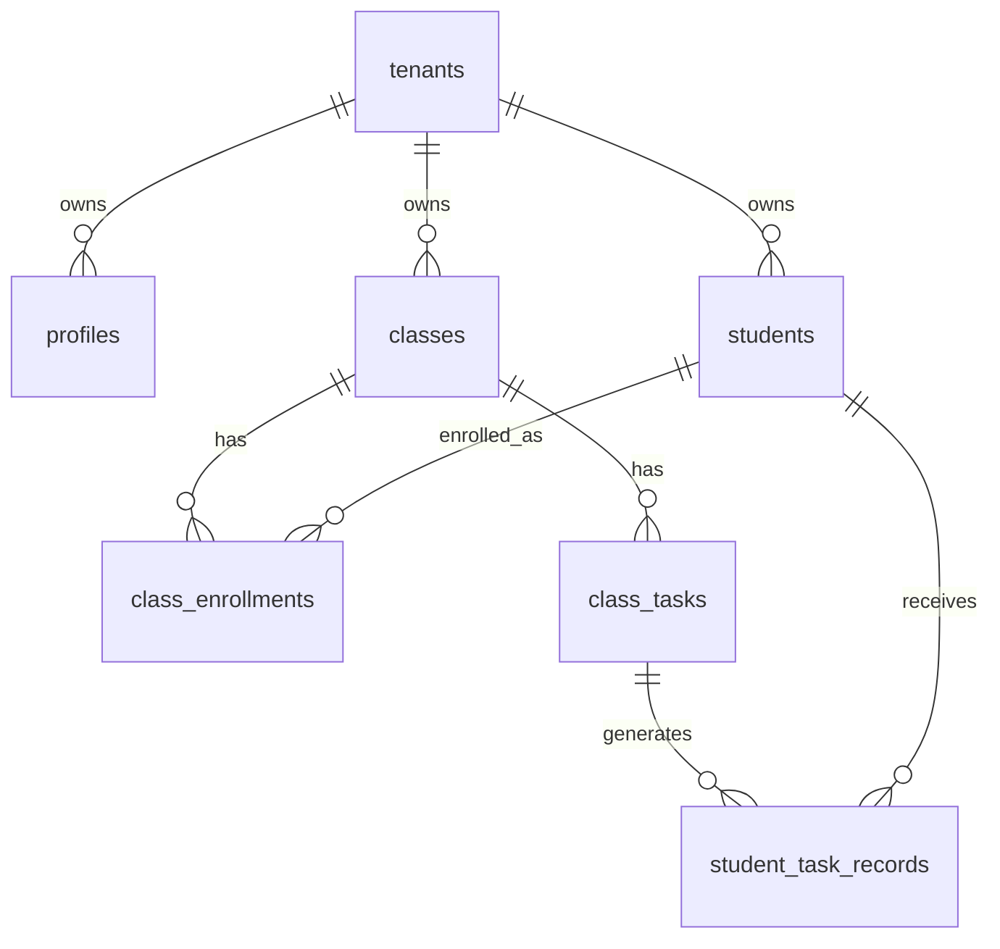
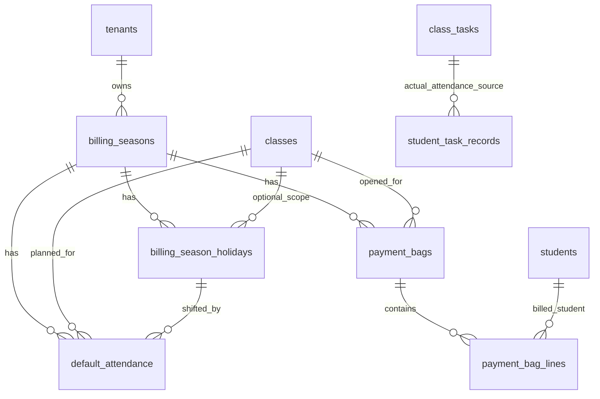
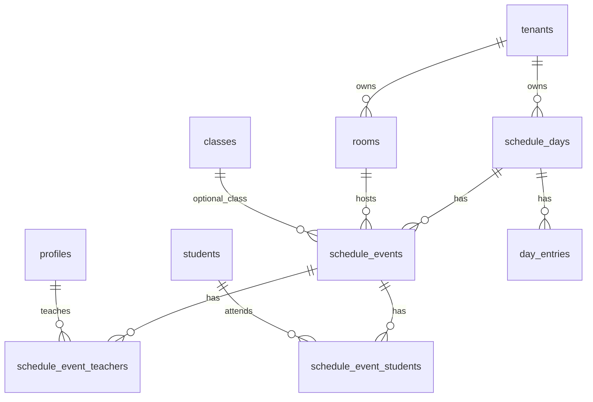

# JianYiOS DB Relationship Cleanup Plan

Date: 2026-06-15

Source of truth for this document:

- Live Supabase schema snapshot: `docs/supabase-live-snapshot.md`
- Supabase Dashboard > Database > Tables, verified in Chrome on 2026-06-15
- Current app-facing schema migrations:
  - `supabase/migrations/20260614000001_clean_core_rebuild.sql`
  - `supabase/migrations/20260614000002_schedule_tables.sql`
  - `supabase/migrations/202606150001_billing_open_bag.sql`
- Current Next.js query layer:
  - `lib/grade/queries.ts`
  - `lib/billing/service.ts`
  - `app/api/schedule/events/route.ts`
  - `app/api/day-entries/route.ts`

## Current Live Shape

Live DB currently has 18 public tables:

| Area | Tables | Current role |
|---|---|---|
| Tenant/account | `tenants`, `profiles` | Tenant boundary and staff profile. |
| Core school data | `students`, `classes`, `class_enrollments` | Student master, class master, and active/dropped roster membership. |
| Grade/task workflow | `class_tasks`, `student_task_records` | Class-level tasks and per-student task results. |
| Billing/open bag | `billing_seasons`, `billing_season_holidays`, `default_attendance`, `payment_bags`, `payment_bag_lines` | Billing seasons, holiday shifts, planned attendance sessions, payment bags, and student billing lines. |
| Schedule | `rooms`, `schedule_days`, `schedule_events`, `schedule_event_teachers`, `schedule_event_students` | Calendar day, room, class event, teacher assignment, student assignment. |
| Day workspace | `day_entries` | Todo/dinner/workday entries attached to `schedule_days`. |

The old app prototype tables `class_students`, `tasks`, and `task_records` are no longer present in live DB. The old Google Sheet bridge/import tables are also no longer present in live DB.

## Core Relationship Map

Rules:

- `students` is the school-wide student master.
- `classes` is the class master.
- `class_enrollments` is the roster join table. A student can belong to multiple classes.
- `class_tasks` is one task/attendance/comment row for a class.
- `student_task_records` is each student's result for one `class_task`.
- All app-facing core tables carry `tenant_id`.
- Core child tables should keep tenant consistency through composite foreign keys where possible: `(parent_id, tenant_id) -> (id, tenant_id)`.

## Billing Relationship Map

Important decision:

- There is no separate `actual_attendance` table.
- Actual attendance is represented by `class_tasks.task_type = 'attendance'` plus `student_task_records`.
- `default_attendance` is the planned billing calendar.
- Billing reconciliation compares `default_attendance` with attendance tasks/records.

## Schedule Relationship Map

There used to be a separate imported workspace schedule model (`schedule_workspaces`, `schedule_sections`, `schedule_time_slots`, `schedule_assignments`, `schedule_side_notes`). Those tables are not in live DB now. The app is currently using the newer calendar model: `rooms`, `schedule_days`, `schedule_events`, `schedule_event_teachers`, `schedule_event_students`.

## Live Row Counts

From `docs/supabase-live-snapshot.md`, generated on 2026-06-15:

| Table | Rows |
|---|---:|
| tenants | 1 |
| profiles | 1 |
| students | 2 |
| classes | 2 |
| class_enrollments | 4 |
| class_tasks | 62 |
| student_task_records | 123 |
| billing_seasons | 2 |
| billing_season_holidays | 2 |
| default_attendance | 48 |
| payment_bags | 1 |
| payment_bag_lines | 2 |
| rooms | 6 |
| schedule_days | 1 |
| schedule_events | 5 |
| schedule_event_teachers | 0 |
| schedule_event_students | 0 |
| day_entries | 1 |

Class summary:

| Class | Active enrollments | Active class tasks | Task records |
|---|---:|---:|---:|
| `A` / `B5` | 2 | 13 | 26 |
| `TQ1` / `測試班-開袋E2E` | 2 | 49 | 97 |

## Problems To Clean Up

1. `docs/supabase-db-map.md` is outdated.
   It still says `class_students/tasks/task_records` are the app-facing grade track. Live DB now uses `class_enrollments/class_tasks/student_task_records`.

2. Several Chinese docs are mojibake.
   `docs/clean-core-schema.md` and `docs/supabase-db-cleanup-status.md` are not reliable for handoff because their Chinese text is corrupted.

3. `20260614000001_clean_core_rebuild.sql` is in `supabase/migrations/` but still says "DRAFT do not auto-apply" in the header.
   The file has already become the live direction. The header should be corrected so future operators do not misunderstand its status.

4. There are two incompatible meanings for `schedule_days` in migration history.
   `202606120002_workspace_schedule_schema.sql` defines imported workspace-style `schedule_days` with `workspace_id/day_key`.
   `20260614000002_schedule_tables.sql` defines calendar-style `schedule_days` with `date/weekday`.
   Live DB uses the calendar-style table. The old workspace migration should be archived, renamed, or clearly marked as superseded.

5. `day_entries` existed in live DB but was missing from migration history.
   This is now captured by `supabase/migrations/202606150002_day_entries.sql`.

6. `scripts/check-db.mjs` contains hardcoded Supabase credentials and mojibake output.
   Prefer `.env.local` like `scripts/audit-supabase-db.mjs`, or remove this script if it is no longer used.

## Recommended Cleanup Order

1. Freeze the canonical model:
   `students`, `classes`, `class_enrollments`, `class_tasks`, `student_task_records`.

2. Update docs:
   Replace or supersede `docs/supabase-db-map.md` with this live relationship map.
   Keep `docs/supabase-live-snapshot.md` generated from `npm run audit:supabase`.

3. Fix migration history for fresh rebuilds:
   Keep `supabase/migrations/202606150002_day_entries.sql` with the schedule/day workflow.
   Clarify or archive the old workspace schedule migration.
   Correct the misleading "DRAFT" header in `20260614000001_clean_core_rebuild.sql`.

4. Verify DB invariants:
   Every app-facing table has `tenant_id`.
   Every child table either has a tenant-consistent FK or is checked in service code.
   Every active enrollment has records created when a new class task is added.

5. Then clean app queries:
   Remove remaining references to old prototype names if any appear later.
   Keep all grade UI queries on `class_enrollments/class_tasks/student_task_records`.

## Naming Decision

Use these names going forward:

| Concept | Canonical table |
|---|---|
| Student master | `students` |
| Class master | `classes` |
| Class roster | `class_enrollments` |
| Class task / attendance / comment row | `class_tasks` |
| Student task result | `student_task_records` |
| Planned billing session | `default_attendance` |
| Actual attendance | `class_tasks` + `student_task_records` |
| Payment bag header | `payment_bags` |
| Payment bag student line | `payment_bag_lines` |
| Calendar class event | `schedule_events` |
| Daily todo/work item | `day_entries` |
