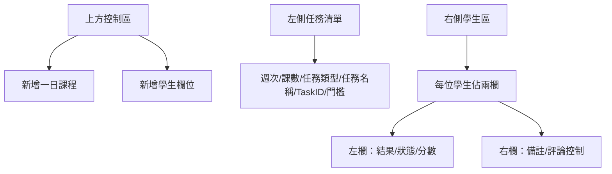
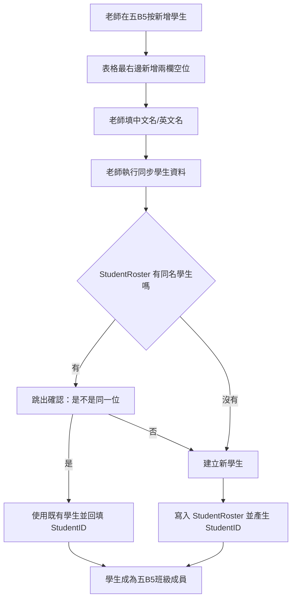

# 五B5 分頁白話功能整理

日期：2026-06-14

來源：

- Google Sheet：`簡誼OS_重新架構_2.1`
- 分頁：`五B5`
- 本機快照：`reference/google_sheet_2_1_live.xlsx`
- Apps Script：
  - `apps-script/05_ClassDay_Insert.js`
  - `apps-script/10_StudentSync_Core.js`
  - `apps-script/11_StudentSync_EngAdapter.js`
  - `apps-script/19_StudentSync_MatcherService.js`
  - `apps-script/19_StudentSync_RosterService.js`
  - `apps-script/03_Eng_Task_Adapter.js`
  - `apps-script/20_Task_to_Buffer Core.js`
  - `apps-script/06_AIComment.js`

相關文件：

- `docs/studentroster-plain-functional-brief.md`
- `docs/classconfig-plain-functional-brief.md`

## 一句話版

`五B5` 是英文班的老師操作面板，同時也是資料輸入表。

它不是單純資料表。它把三件事混在同一張 Google Sheet 裡：

1. 班級名單
2. 課程任務/作業/考試
3. 每位學生對每個任務的狀態、分數、備註、家長評論

新版 app 不應該照抄這張表。應該把它拆成「班級頁 UI」和「乾淨資料表」。

## 畫面怎麼看



## 五B5 現在的格局

| 區塊 | Google Sheet 位置 | 白話意思 |
|---|---|---|
| 分頁身份 | `A1 = ENG_CLASS`, `B1 = ENG` | 這是一張英文班級表。 |
| 指揮官週次/課數 | `C1`, `D1` | 老師要新增或派發哪一週、哪一課。 |
| 新增一日課程 | `A2` | 會插入一組預設任務列。 |
| 新增學生欄位 | `C2` | 會在最右邊多加一位學生的兩欄空位。 |
| 學生基本資料 | 第 1 到 4 列、G 欄以後 | 學生順序、中文名、英文名、StudentID。 |
| 任務資料 | 第 5 列開始、A 到 F 欄 | 週次、課數、任務類型、任務名稱、TaskID、門檻。 |
| 學生任務結果 | 第 5 列開始、G 欄以後 | 每位學生每個任務的狀態、分數、備註。 |

## 新增學生的真正邏輯

使用者補充的規則：

> 在五B5 這邊新增學生，就等於把學生加入這個班級。要先從 StudentRoster 找是否已存在此學生。若是新生，就寫回 StudentRoster 建立資料。

Apps Script 目前也是這個方向，但分成兩個動作：



白話說：

- `StudentRoster` 是另一個分頁，是全校學生主名冊。
- `五B5` 只是把學生放進這個班的位置。
- 新版 app 應該把「新增欄位」改成「加入學生到班級」。
- 加入時先搜尋既有學生，找不到才建立新生。

## 新版 app 應該長怎樣

### 加入學生流程

1. 老師在五B5班級頁按「加入學生」。
2. 系統開一個搜尋框。
3. 老師輸入中文名、英文名、電話或 StudentID。
4. 如果找到既有學生：
   - 顯示候選學生。
   - 老師選一位。
   - 系統建立班級成員關係。
5. 如果找不到：
   - 老師建立新學生。
   - 系統新增學生主檔。
   - 同時把學生加入五B5。

### 不要照抄的地方

| 舊 Google Sheet 做法 | 新版 app 做法 |
|---|---|
| 新增兩欄代表新增學生 | 建立一筆班級成員關係。 |
| 用欄位位置代表學生順序 | 用 `slot_order` 或排序欄位記錄座位/顯示順序。 |
| 中文名/英文名直接寫在班級表上 | 學生姓名存在學生主檔，班級頁只引用。 |
| StudentID 寫在第 4 列 | 學生有正式 ID，班級關係指向學生。 |

## 任務與成績的邏輯

五B5 的每一列任務，大致有這些類型：

| 任務類型 | 白話意思 | 例子 |
|---|---|---|
| 出席 | 這一課有沒有來 | W1 L1 出席 |
| 作業 | 要交的作業 | 單字 |
| 練習 | 課堂或課後練習 | 課文 |
| 考試 | 有分數和門檻的小考 | 單字 90分、聽力 88分 |
| 評論 | 給家長看的文字回饋 | 老師評論、AI潤稿、發布狀態 |

每位學生對每個任務會有一個狀態。

| 顯示 | 白話意思 |
|---|---|
| 紅色 | 還沒完成、待處理。 |
| 綠色完/過 | 已完成，或考試已通過。 |
| 黃色訂 | 需要訂正。 |
| 藍色驗 | 分數達標但需要老師驗收。 |
| 黑色缺 | 缺考、缺交、未做。 |
| 白色免 | 免做、免考。 |
| RE | 需要重做或重考。 |

## 從五B5 推出的資料表草案

這裡先講概念，不急著寫 SQL。

| 資料表概念 | 用途 | 對應五B5 |
|---|---|---|
| `students` | 學生主檔 | StudentRoster 裡的學生。 |
| `classes` | 班級主檔 | 來源是 `ClassConfig`；記錄班級 ID、分頁名稱、班級名稱、班型、星期、堂數與狀態。 |
| `class_enrollments` | 學生加入哪個班 | 五B5 的學生欄位。 |
| `lessons` 或 `class_lessons` | 週次/課數 | W1、L1、L2。 |
| `tasks` 或 `assignments` | 作業、練習、考試、評論任務 | 左側每一列任務。 |
| `student_task_records` | 每位學生每個任務的狀態/分數/歷史 | 學生欄位裡的紅綠黃藍狀態。 |
| `student_comments` | 給家長看的評論 | 評論列左欄文字。 |
| `comment_publication_status` | 評論是否待發布/已發布/需重發 | 評論列右欄控制。 |

## Claude Code 實作提示雛形

之後可以給 Claude Code 的方向：

```text
請不要照 Google Sheet 的格子結構建資料表。

五B5 是英文班級頁，功能是：
1. 顯示班級學生名單。
2. 老師可以加入學生到班級。
3. 加入學生時，先搜尋 students 是否已有此學生。
4. 若已有，建立 class_enrollments 關係。
5. 若沒有，先建立 students，再建立 class_enrollments。
6. 顯示本班 lesson/task 矩陣。
7. 老師可以記錄每位學生每個 task 的狀態、分數、歷史與備註。
8. 評論任務要有待發布、已發布、需重發狀態，並支援 AI 潤稿流程。

請先設計乾淨的 Supabase schema，再做 Next.js UI。
```

## 下一步

下一個應該繼續拆：

1. `五B5` 的「新增一日課程」到底會建立哪些任務。
2. `五B5` 的「派發任務到 Buffer」在新版 app 要不要保留，還是改成直接建立 `student_task_records`。
3. `五B5` 的評論發布流程，未來是否要真的推送給家長端。
