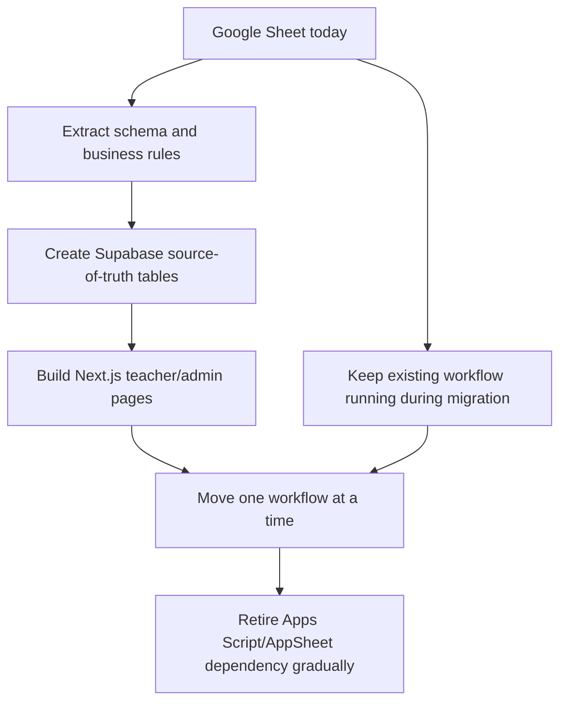
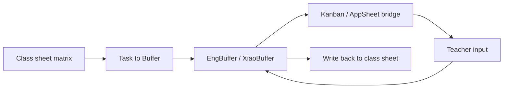
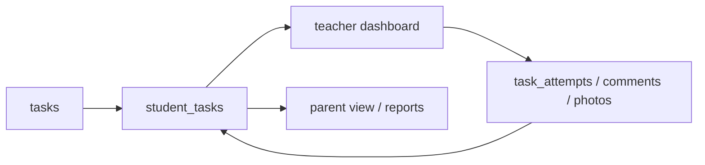

# JIANYI OS Google Sheets to Supabase Migration

Last updated: 2026-06-07

## Purpose

This document records what the current Google Sheets + Apps Script + AppSheet system is doing, and how to gradually move it into a Supabase-centered architecture without breaking the existing daily workflow.

The current Google system should be treated as the legacy prototype and business-rule map. It already proves the workflows. The migration should preserve those workflows, but not copy the sheet layout one-to-one.

## Sources Reviewed

- Google Sheet: `https://docs.google.com/spreadsheets/d/1hqoyUp7zodaiQEKySjwm-uKm3XlqrxnK7nVQMLeZWuI/edit`
- Exported workbook snapshot: `C:\Users\oscar\Desktop\CYEZ\_imports\jianyios_google_sheet.xlsx`
- Apps Script archive: `C:\Users\oscar\Desktop\CYEZ\_imports\JianYiOS_rar\JianYiOS`

The Sheet contains real student and billing data. Do not commit raw exported data or private student/contact information into the app repository.

## Current System Summary

The current system is not only a grade sheet. It is a small internal operating system built on top of Google tools:

- Google Sheets acts as the database, teacher workspace, billing table, and status board.
- Apps Script acts as the backend, automation layer, menu system, sync engine, AI-comment tool, parent portal, and invoice renderer.
- AppSheet acts as a mobile input layer for teachers.
- Buffer sheets act as the current source of truth for task status.
- Class sheets are teacher-facing layouts, not clean database tables.

The core migration idea:

## Sheet Inventory

| Sheet | Current role | Important data | Supabase direction |
| --- | --- | --- | --- |
| `StudentRoster` | Student identity table | `studentId`, Chinese name, English name, status, school, grade, parent fields | `students`, `guardians` |
| `ClassConfig` | Billing/class configuration | class id, sheet name, class code, level, class type, weekdays, sessions | `classes`, `class_schedules`, `billing_plans` |
| `EngBuffer` | English task status buffer | student, class, task, latest result, status, history, threshold, week, loaded board | `student_tasks`, `task_attempts` |
| `XiaoBuffer` | Elementary homework/task status buffer | same as EngBuffer plus grade | `student_tasks`, `task_attempts` |
| `AppSh_Kanban` | AppSheet mobile task bridge | task card display, teacher inputs, comments, photos, sync status | temporary `mobile_task_submissions`, then replace with Next.js UI |
| `AppSh_Input` | AppSheet daily input bridge | attendance/homework/quiz row references and inputs | `daily_submissions`, `attendance_records`, `student_tasks` |
| `InvoiceData` | Wide invoice source table | one student-season invoice row with 36 session dates, attendance flags, fees, payment status | split into `invoices`, `invoice_sessions`, `invoice_line_items`, `payments` |
| `SessionCredit` | Make-up/session credit table | owed sessions, discount amount, reason, status | `session_credits` |
| `InvoiceConfig` | Fee presets | class level, sessions, price, fee presets | `fee_presets`, `billing_plans` |
| `配課表UI` | Scheduling/workspace UI | day/time blocks, pickup notes, room/class placement | rebuild as a Next.js scheduling page; do not store as one table |
| English class sheets such as `發3`, `F發4`, `G8課`, `五B5` | Teacher-facing class matrix | week, lesson, task type, task name, task id, student columns | normalize into classes, sessions, tasks, enrollments, results |
| `作業` | Elementary homework matrix | date rows, attendance/homework/quiz slots, student columns | normalize into sessions, assignments, attendance, submissions |
| `_ENG_CLASS_TEMPLATE` | Sheet template | default English class layout | replace with UI templates and database defaults |

## Important Headers Found

### Student Roster

`studentId`, `chineseName`, `englishName`, `status`, `school`, `grade`, `note`, `updatedAt`, `parentName`, `parentPhone`

### Task Buffers

English buffer:

`studentId`, `className`, `engName`, `chiName`, `taskName`, `taskId`, `latestResult`, `status`, `history`, `threshold`, `week`, `writebackStatus`, `lastUpdated`, `loadedTo`

Elementary buffer adds:

`grade`

### AppSheet Kanban Bridge

`mobileKanbanTaskId`, `source`, `loadedTo`, `className`, `studentId`, `studentName`, `chiName`, `engName`, `taskId`, `taskName`, `taskType`, `currentStatus`, `currentLamp`, `taskDisplay`, `history`, `threshold`, `latestResult`, `scoreInput`, `statusInput`, `commentInput`, `privateNoteInput`, `photo1`, `photo2`, `photo3`, `photo4`, `photo5`, `syncStatus`, `syncMessage`, `lastUpdated`

### AppSheet Daily Input Bridge

`dailyRowId`, `className`, `dateKey`, `dateDisplay`, `studentId`, `studentName`, `chiName`, `engName`, `slotIndex`, `contentCol`, `attendanceRow`, `attendanceInput`, homework slots 1-5, quiz slots 1-3, `syncStatus`, `syncMessage`, `lastUpdated`

### Invoice Data

`InvoiceData` currently has 110 columns. It mixes identity, class, season, holidays, make-up dates, 36 session dates, 36 attendance flags, tuition, book fee, misc fee, discounts, final amount, payment status, print status, distribution status, balance, and receipt status.

This should be split before moving to Supabase.

## Current Workflow Map

### Student and Class Sync

`StudentRoster` is the identity base. English and elementary class sheets use student IDs such as `S001`, `S002`, etc. Apps Script syncs names and class membership from class sheets back into roster-related structures.

Supabase target:

- Keep legacy student IDs in `students.legacy_student_id`.
- Use Supabase UUIDs internally.
- Model class membership with `class_enrollments` instead of placing students as columns.

### Task Pipeline

Current path:

Supabase target:

The important change: Supabase becomes the source of truth. Kanban becomes a view, not a storage layer.

### Parent Portal

Current Apps Script module `07_ParentPortal.js` searches `StudentRoster`, reads English/Xiao buffers, and returns parent-facing status and comments.

Supabase target:

- `parent_portal_profiles`
- `guardians`
- `student_tasks`
- `parent_comments`
- optional LINE binding through `line_user_id`

### AI Comment Workflow

Current Apps Script module `06_AIComment.js` handles AI polishing, publish, retract, and row-level status.

Supabase target:

- `parent_comments`
- `ai_comment_drafts`
- `comment_publication_events`

Keep the same product rule: AI writes or polishes drafts, but a teacher approves before publishing.

### Billing and Invoices

Current invoice logic is functional but very sheet-shaped. `InvoiceData` stores a whole season invoice in one wide row.

Supabase target:

- `billing_seasons`
- `fee_presets`
- `invoices`
- `invoice_sessions`
- `invoice_line_items`
- `payments`
- `session_credits`
- `invoice_print_events`

Do not recreate the 110-column `InvoiceData` table directly unless it is only a temporary import staging table.

## Recommended Supabase Tables

### Core School Data

- `tenants`
- `students`
- `guardians`
- `teachers`
- `classes`
- `class_schedules`
- `class_enrollments`
- `class_sessions`

### Assignments and Scores

- `tasks`
- `student_tasks`
- `task_attempts`
- `attendance_records`
- `teacher_notes`
- `student_photos`

### Parent Communication

- `message_threads`
- `messages`
- `ai_message_analyses`
- `reply_drafts`
- `parent_comments`
- `comment_publication_events`

### Speaking Practice

- `speaking_books`
- `speaking_items`
- `speaking_attempts`
- `speaking_word_results`
- `speaking_phoneme_results`

This connects the current ChienYi Talk Azure pronunciation assessment feature into the broader JIANYI OS.

### Billing

- `billing_seasons`
- `fee_presets`
- `invoices`
- `invoice_sessions`
- `invoice_line_items`
- `payments`
- `session_credits`
- `invoice_print_events`

## Migration Phases

### Phase 0: Preserve and Document

Keep Google Sheets running. Take controlled exports and document current modules, statuses, and column meanings.

Deliverables:

- Google workbook snapshot
- Apps Script source snapshot
- Sheet-to-table mapping
- status code mapping, such as `pending`, `completed`, `redo`, `correcting`, `missing`

### Phase 1: Supabase Foundation

Start with stable identity data:

- students
- guardians
- classes
- class schedules
- class enrollments

Import from:

- `StudentRoster`
- `ClassConfig`
- English class sheets
- elementary class sheet

Preserve legacy IDs so old and new systems can talk to each other.

### Phase 2: Task and Score System

Move the most important daily teaching workflow:

- tasks
- student task statuses
- score attempts
- attendance
- comments
- photo attachments

Import from:

- `EngBuffer`
- `XiaoBuffer`
- `AppSh_Kanban`
- `AppSh_Input`

At this phase, the Next.js teacher dashboard can start replacing AppSheet.

### Phase 3: Parent Portal and LINE

Rebuild the parent-facing view from Supabase:

- parent search or login
- current homework and score status
- published teacher comments
- LINE binding later

This replaces the Apps Script parent portal gradually.

### Phase 4: Billing

Split invoice data into normalized tables.

Use `InvoiceData` as an import source, but do not keep its 110-column shape as the permanent design.

### Phase 5: Retire Google Dependency

After each module has a Next.js page and Supabase source-of-truth table, reduce Google Sheets to one of these roles:

- read-only archive
- temporary backup export
- no longer used

## Temporary Bridge Strategy

During migration, Google and Supabase can coexist.

Good bridge options:

- Apps Script sends updates to a Next.js API route whenever important rows change.
- A scheduled import job reads Google Sheet exports and syncs into Supabase.
- New Next.js pages read Supabase first, while old Google pages continue serving un-migrated workflows.

Avoid making both Google Sheets and Supabase authoritative for the same workflow. Pick one source of truth per module.

## Design Rules for the New Architecture

- Do not model students as columns. Use rows with `student_id`.
- Do not model 36 invoice sessions as 72 fixed columns. Use `invoice_sessions`.
- Do not treat AppSheet bridge tables as permanent data structures.
- Do not expose Azure, AI, or LINE secrets in frontend code.
- Keep old Google IDs as `legacy_*` fields during migration.
- Put photos/files in Supabase Storage or another object store, not in text columns.
- Use row-level security from the beginning if the system may become multi-tenant later.

## Immediate Next Step

Create the first Supabase schema around:

1. `students`
2. `guardians`
3. `classes`
4. `class_enrollments`
5. `tasks`
6. `student_tasks`
7. `task_attempts`
8. `attendance_records`

This gives the new system enough structure to absorb `StudentRoster`, `EngBuffer`, `XiaoBuffer`, and the future ChienYi Talk speaking scores.
