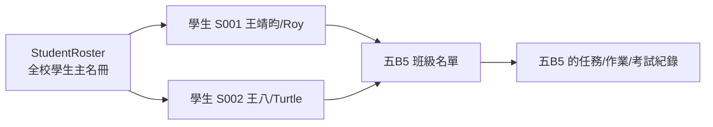
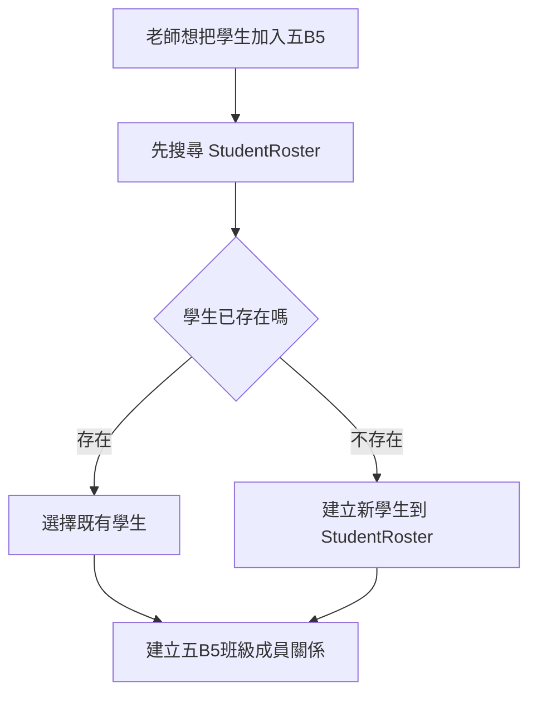

# StudentRoster 分頁白話功能整理

日期：2026-06-14

來源：使用者提供的 `StudentRoster` header 與範例資料。

## 一句話版

`StudentRoster` 是本校學生主名冊。

它不是某一班的名單，而是全校學生資料的來源。像 `五B5` 這種班級分頁，只是把 `StudentRoster` 裡的學生加入到某個班。

## 目前欄位

| 欄位 | 白話意思 | 範例 |
|---|---|---|
| `studentId` | 學生代號 | `S001` |
| `chineseName` | 中文姓名 | `王靖昀` |
| `englishName` | 英文名 | `Roy` |
| `status` | 學生狀態 | `active` |
| `school` | 就讀學校 | 空白也可以 |
| `grade` | 年級 | 空白也可以 |
| `note` | 備註 | 空白也可以 |
| `updatedAt` | 最後更新時間 | 空白也可以 |
| `parentName` | 家長姓名 | 空白也可以 |
| `parentPhone` | 家長電話 | 空白也可以 |

## 和五B5的關係



白話說：

- `StudentRoster` 管「這個學生是誰」。
- `五B5` 管「這個學生有沒有在五B5這班」。
- 五B5 裡的作業、考試、評論，是「這位學生在這個班」底下的紀錄。

## 新增學生時的正確邏輯



所以新版 app 不應該讓老師直接在班級頁亂建一個只屬於五B5的學生。

應該是：

1. 先找全校學生。
2. 找得到，就加入班級。
3. 找不到，才建立新學生。
4. 建立後，也要立刻加入班級。

## 對應到新版 DB

第一版可以這樣設計：

| 新資料表 | 用途 | 來源 |
|---|---|---|
| `students` | 全校學生主檔 | `StudentRoster` |
| `classes` | 班級主檔 | `五B5`、其他班級 |
| `class_enrollments` | 學生加入哪個班 | 五B5 學生欄位 |

`students` 可以先包含：

| 欄位 | 用途 |
|---|---|
| `id` | 系統內部 ID |
| `legacy_student_id` | 舊代號，例如 `S001` |
| `chinese_name` | 中文姓名 |
| `english_name` | 英文名 |
| `status` | active / inactive |
| `school` | 學校 |
| `grade` | 年級 |
| `note` | 備註 |
| `parent_name` | 家長姓名 |
| `parent_phone` | 家長電話 |

之後如果家長資料變複雜，例如一個學生有爸爸、媽媽、接送人、緊急聯絡人，再把 `parent_name` / `parent_phone` 拆成獨立的 `guardians` 表。

## Claude Code 提示雛形

```text
StudentRoster 是全校學生主名冊，不是班級名單。

請設計 students 與 class_enrollments：

students 儲存：
- legacy_student_id，例如 S001
- chinese_name
- english_name
- status
- school
- grade
- note
- parent_name
- parent_phone

class_enrollments 儲存：
- class_id
- student_id
- status
- slot_order

加入學生到班級時：
1. 先搜尋 students。
2. 如果找到既有學生，直接建立 class_enrollments。
3. 如果找不到，先建立 students，再建立 class_enrollments。
4. 不要把同一個學生在不同班級重複建立成多筆 student。
```

