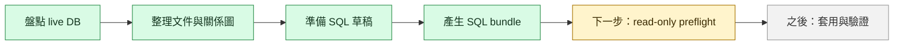

# JianYiOS Supabase DB 整理狀態總表

日期：2026-06-13

這份是目前 Supabase DB 整理工作的「第一張總覽」。如果只想知道現在做到哪裡、下一步做什麼，先看這份。

## 目前狀態

| 項目 | 狀態 | 白話說明 |
|---|---|---|
| Live Supabase 資料庫 | 尚未寫入整理 SQL | 目前還沒有真的改動線上的 Supabase。 |
| 本機 schema 盤點 | 已完成第一版 | 已有 live snapshot、audit、資料表分群與關係圖。 |
| migration 草稿 | 已完成第一版 | 已準備 tenant hardening 與 legacy-to-app backfill SQL。 |
| SQL bundle | 已完成第一版 | 已整理成 preflight、apply、verify，可貼到 Supabase SQL Editor。 |
| 非工程說明 | 已完成第一版 | 已有白話圖解，解釋為什麼有兩條成績資料線。 |
| 實際清理 live DB | 尚未開始 | 還需要先跑 read-only preflight，再決定是否套用。 |

## 一張圖看懂進度

## 已經產出的文件

| 文件 | 給誰看 | 用途 |
|---|---|---|
| `docs/supabase-db-plain-guide.md` | 非工程背景的人 | 白話理解資料表、兩條成績線、整理流程。 |
| `docs/supabase-db-cleanup-status.md` | 所有人 | 快速知道目前完成度與下一步。 |
| `docs/supabase-db-table-dictionary.md` | 所有人 | 每張 table 的白話名稱、筆數、目前能不能刪。 |
| `docs/supabase-db-map.md` | 需要看表關係的人 | 資料表分群與 mermaid 關係圖。 |
| `docs/supabase-db-cleanup-runbook.md` | 要實際操作的人 | 執行順序、停手條件、bundle 路線。 |
| `docs/supabase-db-audit.md` | 工程紀錄 | 盤點結果、決策理由、風險。 |
| `docs/supabase-live-snapshot.md` | 工程與稽核 | 從 live Supabase 讀到的表、欄位、筆數快照。 |

## 已經產出的 SQL 包

| SQL bundle | 類型 | 用途 |
|---|---|---|
| `supabase/bundles/live_cleanup_preflight.sql` | 只讀 | 先看會補什麼、是否有 blocked row。 |
| `supabase/bundles/live_cleanup_apply.sql` | 寫入 | 確認 preflight 沒問題後，才套用 live 清理。 |
| `supabase/bundles/live_cleanup_verify.sql` | 只讀 | 套用後檢查是否整理成功。 |
| `supabase/bundles/fresh_db_apply.sql` | 寫入 | 給全新 Supabase 或 local reset 用。 |
| `supabase/bundles/fresh_db_verify.sql` | 只讀 | 驗證全新 Supabase 或 local reset。 |

## 下一步

如果要繼續整理 live Supabase：

1. 先跑 `npm.cmd run build:supabase-bundles`，確保 bundle 是最新的。
2. 在 Supabase SQL Editor 跑 `supabase/bundles/live_cleanup_preflight.sql`。
3. 如果結果沒有 `blocked_*`，才考慮跑 `supabase/bundles/live_cleanup_apply.sql`。
4. 套用後立刻跑 `supabase/bundles/live_cleanup_verify.sql`。
5. 最後回到 app 裡檢查班級，透過 app 派發 missing `task_records`。

## 目前不能做的事

| 不要做 | 原因 |
|---|---|
| 不要直接刪 legacy tables | 舊 Google Sheet 匯入線仍是來源證據。 |
| 不要跳過 preflight 直接套用 | 需要先確認沒有 blocked row。 |
| 不要用 SQL 硬塞所有 `task_records` | 每位學生結果應經過 app 的派發與確認流程。 |
| 不要把 fresh DB bundle 貼到 live DB | fresh bundle 是給全新資料庫或 reset 用，不是現場整理用。 |
