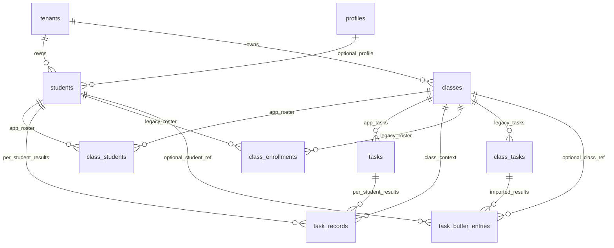
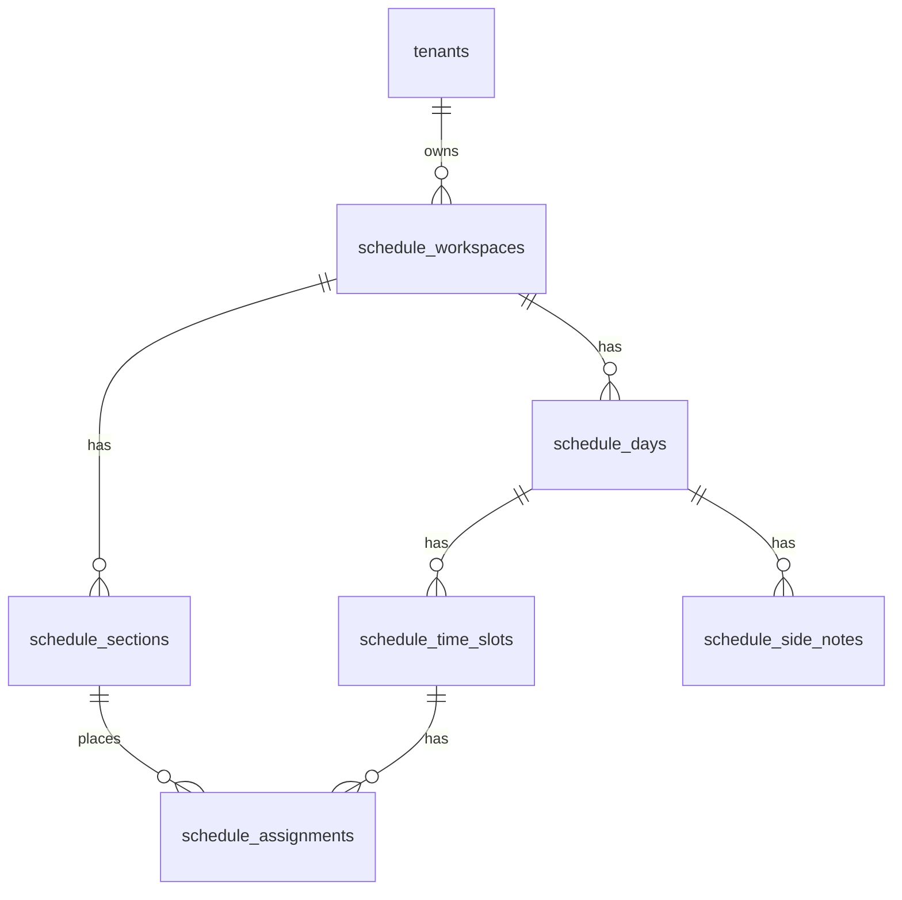
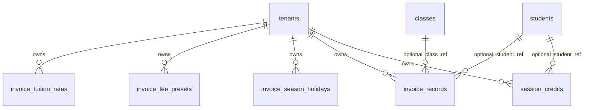

# Supabase DB Map

Date: 2026-06-13

Project: `pmoyvpnbbitnigchvluz`

This is the quick handoff map for JianYiOS Supabase tables. It focuses on how
tables relate to each other and which track should drive the current Next.js UI.

## Current Decision

Use `class_students` / `tasks` / `task_records` as the app-facing grade track.

Preserve `class_enrollments` / `class_tasks` / `task_buffer_entries` as the
legacy import track until the imported Google Sheets data has been fully
reviewed and dispatched through the app.

## Table Groups

| Group | Tables | Role |
|---|---|---|
| Tenant/core | `tenants`, `profiles` | Account and tenant boundary. |
| Grade UI track | `students`, `classes`, `class_students`, `tasks`, `task_records` | Current Next.js class and grade workflow. |
| Legacy grade import track | `class_enrollments`, `class_tasks`, `task_buffer_entries`, `appsh_kanban_rows`, `appsh_xiao_daily_rows` | Imported Google Sheets/App Script data. |
| Schedule workspace | `schedule_workspaces`, `schedule_sections`, `schedule_days`, `schedule_time_slots`, `schedule_assignments`, `schedule_side_notes` | Timetable/workspace UI from legacy sheet. |
| Invoice/import | `invoice_tuition_rates`, `invoice_fee_presets`, `invoice_season_holidays`, `invoice_records`, `session_credits` | Tuition/invoice legacy model. |
| Legacy metadata | `legacy_sheet_schemas`, `legacy_appscript_files`, `kanban_ranges` | Mapping and documentation for old Apps Script/sheets. |

## Grade Relationships

## Schedule Relationships

## Invoice Relationships

## Live Snapshot Notes

From `docs/supabase-live-snapshot.md`:

| Fact | Meaning |
|---|---|
| `class_students` has 7 rows and no `tenant_id` column yet | Run tenant hardening before relying on tenant-scoped policies. |
| `class_enrollments` has 16 rows, `class_tasks` has 40 rows | Legacy import track has more structure than the current UI track. |
| `tasks` has 8 rows, `task_records` has 29 rows | App track already has dispatched records for some classes. |
| `CLS-001`, `CLS-002`, `CLS-003` have legacy rows but little/no app-track rows | These are the main convergence targets. |

## Cleanup Order

1. Run `supabase/bundles/live_cleanup_preflight.sql`.
2. If there are no blocked rows, run `supabase/bundles/live_cleanup_apply.sql`.
3. Run `supabase/bundles/live_cleanup_verify.sql`.
4. Open affected classes in the app and dispatch missing `task_records` through the app flow.
5. Keep raw legacy tables until the app-facing records are reviewed.

## Do Not Drop Yet

Do not drop these until after manual review:

| Tables | Why |
|---|---|
| `class_enrollments`, `class_tasks`, `task_buffer_entries` | Still needed as source-of-truth for imported class/task structure. |
| `appsh_kanban_rows`, `appsh_xiao_daily_rows` | Preserve original sheet-shaped rows for debugging. |
| `legacy_sheet_schemas`, `legacy_appscript_files`, `kanban_ranges` | Useful migration map and provenance. |

