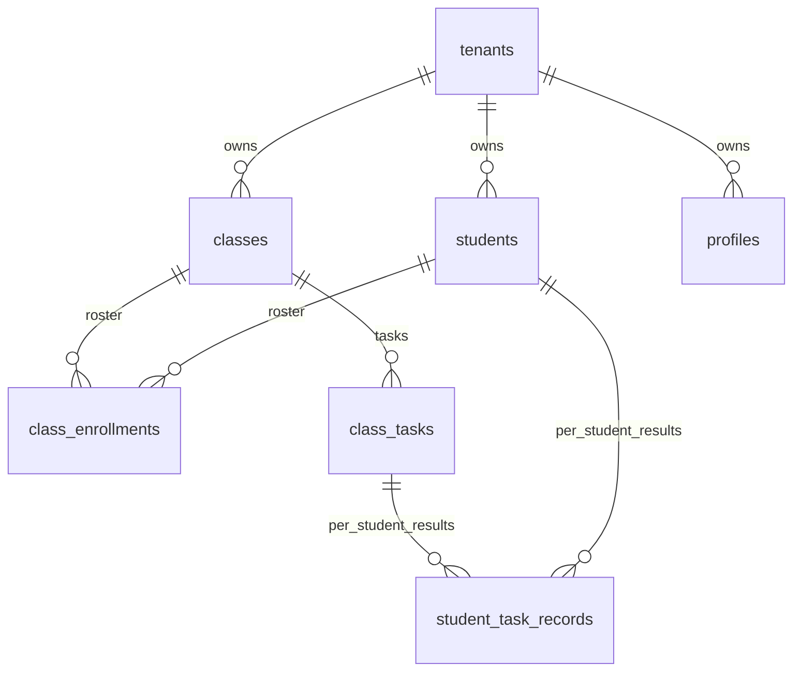
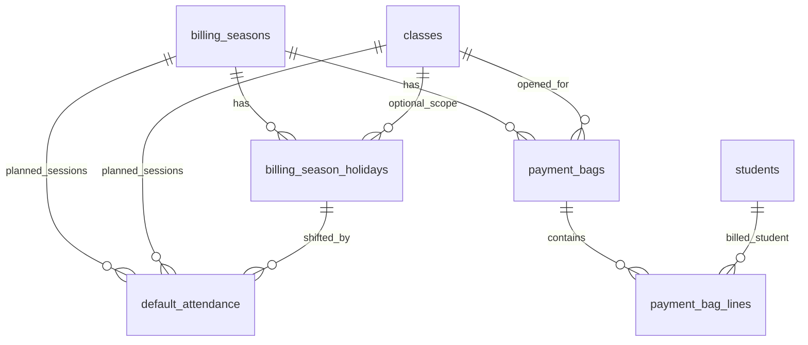
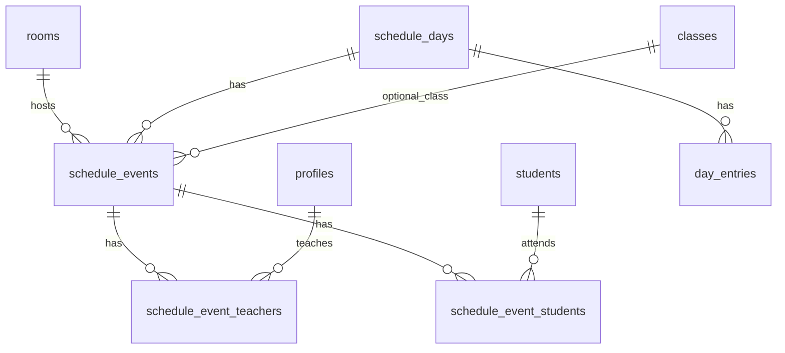

# Supabase DB Map

Date: 2026-06-15

Project: `pmoyvpnbbitnigchvluz`

This is the current live-facing DB map for JianYiOS. The detailed cleanup notes
and next steps live in `docs/db-relationship-cleanup-plan.md`. The generated
live schema and row-count snapshot lives in `docs/supabase-live-snapshot.md`.

## Current Decision

Use `class_enrollments` / `class_tasks` / `student_task_records` as the
canonical grade track.

The older prototype tables `class_students`, `tasks`, and `task_records` are no
longer in live DB. The older Google Sheet bridge/import tables are also no
longer in live DB.

## Table Groups

| Group | Tables | Role |
|---|---|---|
| Tenant/core | `tenants`, `profiles` | Tenant boundary and staff profile. |
| School core | `students`, `classes`, `class_enrollments` | Student master, class master, roster membership. |
| Grade/task | `class_tasks`, `student_task_records` | Class tasks and each student's record/result. |
| Billing/open bag | `billing_seasons`, `billing_season_holidays`, `default_attendance`, `payment_bags`, `payment_bag_lines` | Open-bag billing workflow. |
| Schedule | `rooms`, `schedule_days`, `schedule_events`, `schedule_event_teachers`, `schedule_event_students` | Calendar schedule workflow. |
| Day workspace | `day_entries` | Todo/dinner/day notes attached to `schedule_days`. |

## Grade Relationships

## Billing Relationships

Billing actual attendance is intentionally not a separate table. It is derived
from `class_tasks.task_type = 'attendance'` plus `student_task_records`.

## Schedule Relationships

## Cleanup Notes

| Issue | Action |
|---|---|
| `day_entries` existed live but had no migration | Added `supabase/migrations/202606150002_day_entries.sql`. |
| Old map referenced removed grade tables | This file now uses `class_enrollments/class_tasks/student_task_records`. |
| `20260614000001_clean_core_rebuild.sql` header still says draft | Correct the header before the next handoff. |
| Old workspace schedule migration conflicts with calendar-style `schedule_days` | Mark `202606120002_workspace_schedule_schema.sql` as superseded or archive it. |

