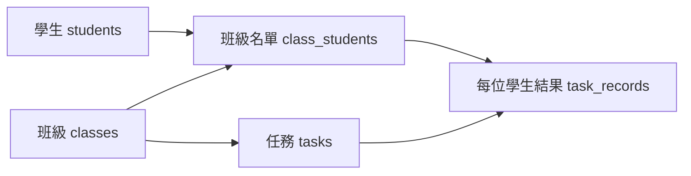
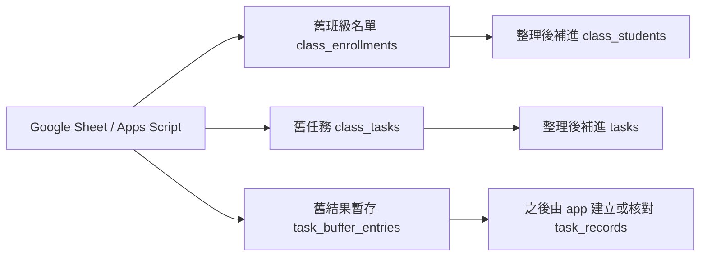
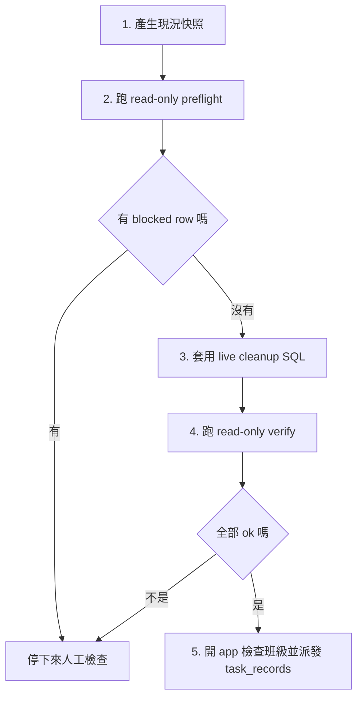

# JianYiOS Supabase DB 白話圖解

日期：2026-06-13

這份文件是給「不一定會寫程式，但需要知道資料庫現在怎麼整理」的人看的。

如果只想先看目前做到哪裡，請先看
`docs/supabase-db-cleanup-status.md`。
如果看到 table 名稱不知道意思，請看
`docs/supabase-db-table-dictionary.md`。

Supabase 可以先想成 JianYiOS 的資料櫃。每一張 table 就像一個抽屜，放一種資料：
學生、班級、作業、成績紀錄、舊 Google Sheet 匯入資料、課表、收費資料。

## 一句話版

現在最大的整理重點是：

> 舊 Google Sheet 匯進來的資料已經在 Supabase 裡，但有一部分還沒有整理到新版 app 會直接使用的資料表。

所以目前不能急著刪舊表。正確做法是先預覽、補齊新版 app 需要的資料、驗證，再慢慢決定哪些舊表可以封存。

## 現在有哪些資料櫃

| 白話名稱 | 主要資料表 | 放什麼 |
|---|---|---|
| 基本身份 | `tenants`, `profiles` | 學校/系統帳號的基本邊界。 |
| 學生與班級 | `students`, `classes` | 學生名單、班級資料。 |
| 新版 app 成績線 | `class_students`, `tasks`, `task_records` | app 現在最應該看的 roster、作業、每位學生的結果。 |
| 舊 Google Sheet 匯入線 | `class_enrollments`, `class_tasks`, `task_buffer_entries` | 從舊表匯進來，還在整理中的 roster、作業、結果暫存。 |
| 課表 | `schedule_workspaces`, `schedule_days`, `schedule_time_slots`, `schedule_assignments` 等 | 從舊課表整理出的可查詢課表資料。 |
| 收費 | `invoice_records`, `invoice_tuition_rates`, `invoice_fee_presets`, `session_credits` 等 | 學費、收費設定、補課/欠堂等資料。 |
| 舊系統說明 | `legacy_sheet_schemas`, `legacy_appscript_files`, `kanban_ranges` | 說明舊 Google Sheet / Apps Script 怎麼對應到新資料庫。 |

## 為什麼會有兩套成績資料

新版 app 主要看這一條：

舊 Google Sheet 匯入資料目前在另一條：

簡單說：

| 線路 | 狀態 | 用途 |
|---|---|---|
| 新版 app 線 | app 目前主要使用 | 老師操作、查看班級、派發任務、看成績。 |
| 舊匯入線 | 保留中 | 當作來源證據，幫忙補齊 app 還缺的 roster / task。 |

## 現場看到的主要問題

根據 `docs/supabase-live-snapshot.md`：

| 問題 | 白話解釋 | 處理方式 |
|---|---|---|
| `class_students` 還沒有 `tenant_id` | 班級名單抽屜少了「屬於哪個學校/帳戶」的標籤。 | 先跑 tenant hardening migration。 |
| 舊匯入線比 app 線有更多班級/任務 | 有些舊班級和任務已匯入，但 app 還看不到完整資料。 | 先 preview，再 backfill 到 app 線。 |
| `task_records` 不直接從 SQL 大量建立 | 每位學生的任務紀錄牽涉老師確認與派發流程。 | 先補 roster/task，再用 app 的 dispatch 流程建立。 |

## 安全整理順序

對應檔案：

| 步驟 | 檔案 |
|---|---|
| 快照 | `npm run audit:supabase` |
| 預覽 | `supabase/bundles/live_cleanup_preflight.sql` |
| 套用 | `supabase/bundles/live_cleanup_apply.sql` |
| 驗證 | `supabase/bundles/live_cleanup_verify.sql` |

## 現在不要刪的東西

目前不要刪這些舊資料表：

| 表 | 原因 |
|---|---|
| `class_enrollments` | 舊 roster 來源，還要拿來補新版 app roster。 |
| `class_tasks` | 舊任務來源，還要拿來補新版 app tasks。 |
| `task_buffer_entries` | 舊結果暫存，之後核對成績時有用。 |
| `appsh_kanban_rows`, `appsh_xiao_daily_rows` | 保留舊表原始形狀，方便查錯。 |
| `legacy_sheet_schemas`, `legacy_appscript_files` | 這是舊系統到新系統的地圖。 |

## 給非工程同事的判斷標準

| 看到什麼 | 可以怎麼判斷 |
|---|---|
| verify 結果全部是 `ok = true` | 這一步整理通過。 |
| preflight 出現 `blocked_*` | 不要套用，先查原因。 |
| app 班級看得到 roster 和 tasks | 表示新版 app 線已經接上。 |
| app 還沒有每位學生 task result | 需要透過 app 的派發流程，不是直接刪表或硬塞資料。 |

## 技術細節在哪裡

| 文件 | 用途 |
|---|---|
| `docs/supabase-db-cleanup-status.md` | 目前進度、下一步、哪些事不能做。 |
| `docs/supabase-db-table-dictionary.md` | 每張 table 的白話名稱、筆數、目前能不能刪。 |
| `docs/supabase-db-map.md` | 工程版資料表關係圖。 |
| `docs/supabase-db-cleanup-runbook.md` | 實際操作 checklist。 |
| `docs/supabase-db-audit.md` | 盤點與決策紀錄。 |
| `docs/supabase-live-snapshot.md` | live Supabase 目前讀到的快照。 |
