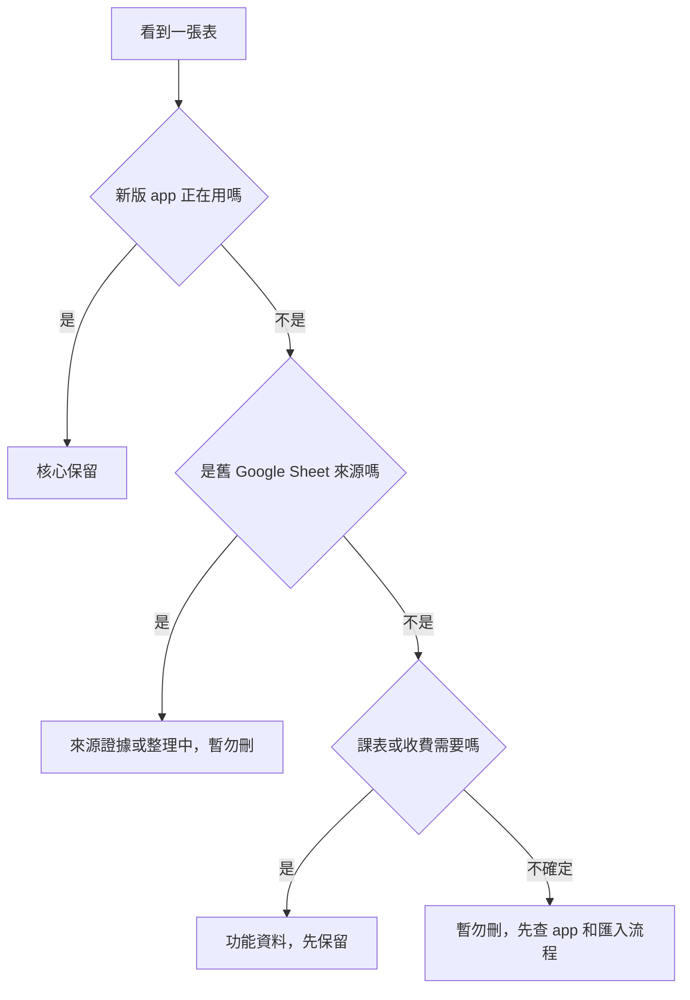

# JianYiOS Supabase 資料表白話字典

日期：2026-06-13

資料來源：`docs/supabase-live-snapshot.md`

這份文件把 Supabase 裡的 table 名稱翻成比較好懂的說法。筆數是當時 live snapshot 讀到的數量，用來判斷哪裡已經有資料、哪裡還只是空架子。

## 狀態標籤

| 標籤 | 意思 |
|---|---|
| 核心保留 | 新版 app 或帳號邊界需要，不能刪。 |
| 整理中 | 有用，但還在從舊 Google Sheet 資料整理到新版 app。 |
| 來源證據 | 暫時保留，用來查舊資料怎麼來的。 |
| 功能資料 | 課表或收費功能需要，先保留。 |
| 暫勿刪 | 目前筆數少或是 0，但還不能判定沒用。 |

## 資料表總表

| Table | 白話名稱 | 筆數 | 分類 | 現在判斷 |
|---|---|---:|---|---|
| `tenants` | 系統/學校空間 | 1 | 核心保留 | 所有資料的歸屬邊界。 |
| `profiles` | 使用者身份資料 | 1 | 核心保留 | 連到登入使用者或角色。 |
| `students` | 學生資料 | 12 | 核心保留 | 新版與舊匯入資料都會連到它。 |
| `classes` | 班級資料 | 5 | 核心保留 | 班級主檔，成績、課表、收費都可能用到。 |
| `class_students` | 新版 app 班級名單 | 7 | 核心保留 | app 目前看的 roster；live 還缺 `tenant_id`，需整理。 |
| `tasks` | 新版 app 任務/作業 | 8 | 核心保留 | app 目前看的任務清單。 |
| `task_records` | 新版 app 每位學生結果 | 29 | 核心保留 | 每位學生對每個任務的結果，不建議用 SQL 硬塞。 |
| `class_enrollments` | 舊匯入班級名單 | 16 | 整理中 | 要拿來補齊 `class_students`。 |
| `class_tasks` | 舊匯入任務/作業 | 40 | 整理中 | 要拿來補齊 `tasks`。 |
| `task_buffer_entries` | 舊匯入成績暫存 | 42 | 整理中 | 之後核對成績與派發結果時需要。 |
| `appsh_kanban_rows` | 舊 Kanban 原始列 | 40 | 來源證據 | 保留舊 Google Sheet 原始形狀，方便查錯。 |
| `appsh_xiao_daily_rows` | 舊小學堂每日列 | 3 | 來源證據 | 保留舊 Google Sheet 原始形狀。 |
| `legacy_sheet_schemas` | 舊表欄位說明 | 11 | 來源證據 | 舊表到新 DB 的對照表。 |
| `legacy_appscript_files` | 舊 Apps Script 檔案說明 | 60 | 來源證據 | 說明舊程式檔案負責什麼。 |
| `kanban_ranges` | 舊 Kanban 範圍設定 | 14 | 來源證據 | 舊 Kanban 區塊的對照資訊。 |
| `schedule_workspaces` | 課表工作區 | 1 | 功能資料 | 課表功能的主檔。 |
| `schedule_sections` | 課表區塊 | 5 | 功能資料 | 課表裡的區域/欄位分區。 |
| `schedule_days` | 課表日期/星期 | 7 | 功能資料 | 課表裡的一週或日期。 |
| `schedule_time_slots` | 課表時間格 | 280 | 功能資料 | 每天的時間段。 |
| `schedule_assignments` | 課表安排內容 | 74 | 功能資料 | 哪個時間、哪個區塊放了什麼課或事項。 |
| `schedule_side_notes` | 課表旁註 | 76 | 功能資料 | 課表旁邊的備註或補充資料。 |
| `invoice_tuition_rates` | 學費級距設定 | 3 | 功能資料 | 收費功能的設定資料。 |
| `invoice_fee_presets` | 費用預設 | 5 | 功能資料 | 書費、雜費等預設。 |
| `invoice_season_holidays` | 季度假日設定 | 2 | 功能資料 | 收費或上課堂數計算會用到。 |
| `invoice_records` | 收費紀錄 | 8 | 功能資料 | 實際收費/發票/繳費資料。 |
| `session_credits` | 欠堂/補堂額度 | 0 | 暫勿刪 | 目前沒資料，但收費與堂數功能可能需要。 |

## 最容易混淆的三組表

### 1. 班級名單

| 表 | 白話說明 |
|---|---|
| `class_students` | 新版 app 要看的班級名單。 |
| `class_enrollments` | 舊 Google Sheet 匯進來的班級名單來源。 |

整理方向：把舊表缺的班級名單補到新版 app 表，但先不要刪舊表。

### 2. 任務/作業

| 表 | 白話說明 |
|---|---|
| `tasks` | 新版 app 要看的任務/作業。 |
| `class_tasks` | 舊 Google Sheet 匯進來的任務/作業來源。 |

整理方向：把舊表缺的任務補到新版 app 表。

### 3. 成績/結果

| 表 | 白話說明 |
|---|---|
| `task_records` | 新版 app 裡每位學生的任務結果。 |
| `task_buffer_entries` | 舊 Google Sheet 匯進來的結果暫存。 |

整理方向：先補 roster 和 tasks，再透過 app 的派發流程建立或核對 `task_records`。

## 清理判斷

## 下一步要看的文件

| 想知道 | 看這份 |
|---|---|
| 目前做到哪裡 | `docs/supabase-db-cleanup-status.md` |
| 用白話看整體流程 | `docs/supabase-db-plain-guide.md` |
| 看表之間怎麼連 | `docs/supabase-db-map.md` |
| 要實際操作 SQL | `docs/supabase-db-cleanup-runbook.md` |

